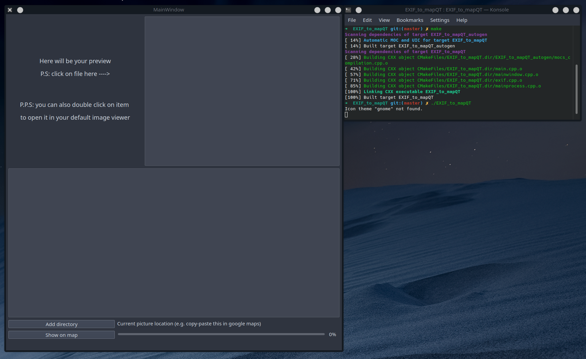
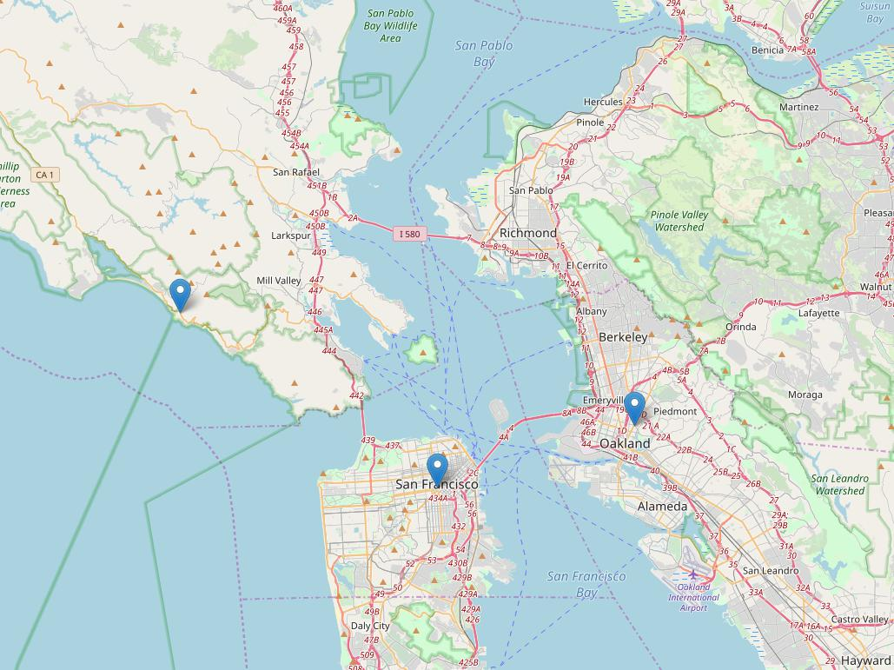
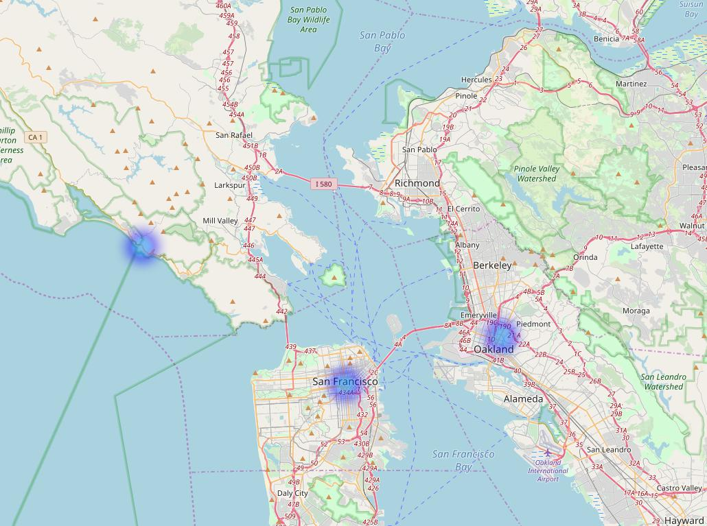

## EXIF-To-MapQT

* TL;DR: UI for this project https://github.com/hntirgeam/EXIF-To-Map

* Simple C++ program with UI (based on QT framework) and python script that will create map with markers on it, by checking all your *.jpeg files for EXIF instancies.  

* The idea was to find out WHERE I took my photos and show it on the interactive world map. Parsing operation is running in sub-thread so UI won't be blocked by this operation. 

* Library used for parsing EXIF:  https://github.com/mayanklahiri/easyexif

## Compile
* `cmake .` , `make` and `./<filename>` 

## Program look like this:

## Map example:
* ### Map will look like this:

* ### Heatmap will look like this:

## To-do: 
* Find out how to properly kill threads (rn you can spam "Show on map button and each time it will create a new thread")
* Learn patterns
